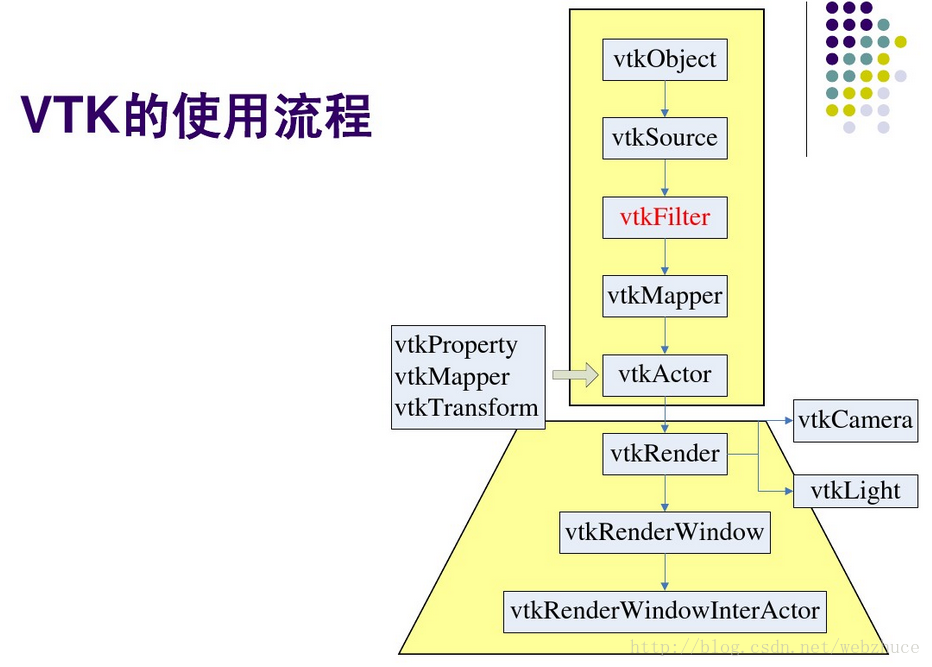
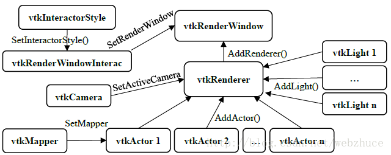
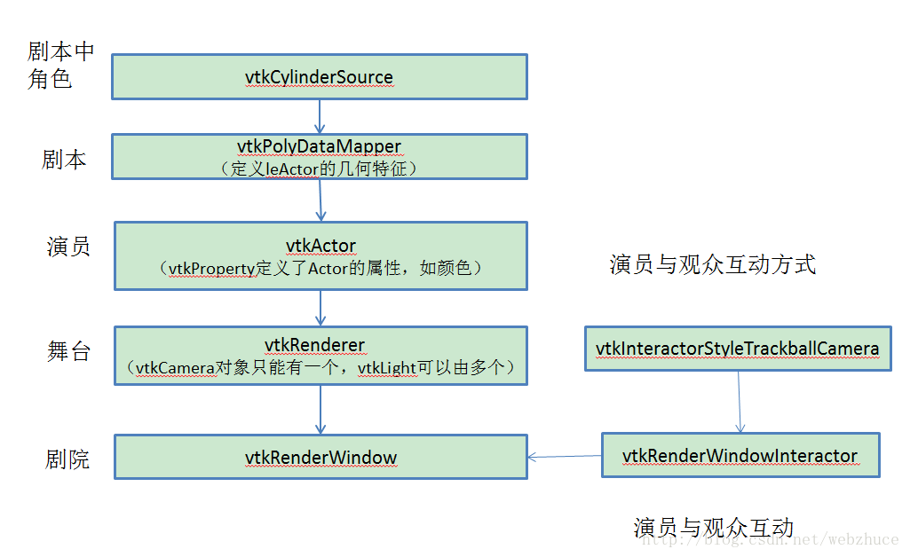

# [VTK工作流程](https://blog.csdn.net/webzhuce/article/details/68954469)

# 以圆柱体为例介绍主要对象

## 1. vtkSource
  数据源，对应代码中的vtkCylinderSource，派生于vtkPolyDataAlgorithm类。

## 2. vtkMapper
  映射器，对应代码中vtkPolyDataMapper，继承于vtkMapper类，将输入的数据转换成几何图元（点、线、多边形）进行渲染。

## 3. vtkActor
  派生于vtkProp类，渲染场景中数据的可视化表达通过vtkProp的子类负责。三维空间中渲染对象最常用的vtkProp子类有vtkActor（表达场景中的几何数据）和vtkVolume（表达场景中的体数据）；二维空间中的数据则用vtkActor2D表达。
  vtkProp依赖于两个对象：一个是vtkMapper对象，负责存放数据和渲染信息，另外一个是属性（vtkProperty）对象，负责控制颜色、不透明度等参数。

## 4. vtkRenderer
  渲染器，负责管理场景的渲染过程。组成场景的对象包括Prop、相机（vtkCamera）和光照（vtkLight），一个vtkRenderWindow中可以有多个vtkRenderer对象。
  vtkRenderer::AddActor()：该方法用于将vtkProp类型的对象添加到渲染场景中。
  vtkRenderer::SetBackground()：该方法用于设置渲染场景的背景颜色。

## 5. vtkRenderWindow
  窗口，将操作系统与VTK渲染引擎连接到一起。不同平台下的vtkRenderWindow子类负责管理本地计算机系统中窗口创建和渲染过程。当使用VTK开发应用程序时，只需要使用与平台无关的vtkRenderWindow类，运行时，系统会自动替换为与平台相关的vtkRenderWindow子类。比如，Windows下运行，实际创建的是vtkWin32OpenGLRenderWindow对象。vtkRenderWindow中包含了vtkRender集合、渲染参数，如立体显示（Stereo）、反走样、运动模糊（Motion Blur）和焦点深度（Focal Depth）等。

## 6. vtkRenderWindowInteractor
  窗口交互器，提供平台独立的响应鼠标、键盘和时钟事件的交互机制，通过VTK的观察者/命令模式将监听到的特定平台的鼠标、键盘和时钟事件交由vtkInteractorObserver或其子类，如vtkInteractorStyle进行处理。vtkInteractorStyle等监听到这些消息并进行处理以完成旋转、拉伸和缩放等运动控制。
  vtkRenderWindowInteractor会自动建立一个默认的3D场景交互器样式（Interactor Style）:vtkInteractorStyleSwitch。也可以选择其他交互器样式或者创建自己的交互器样式，上面使用的是vtkInteractorStyleTrackballCamera。

## 7. vtkInteractorStyle
  交互器样式，对应上面的vtkInteractorStyleTrackballCamera，派生自vtkInteractorStyle。vtkInteractorStyleTrackballCamera样式下，用户通过控制相机对物体旋转、放大、缩小等操作。

# 以上各对象关系

# 示例代码中各对象关系

